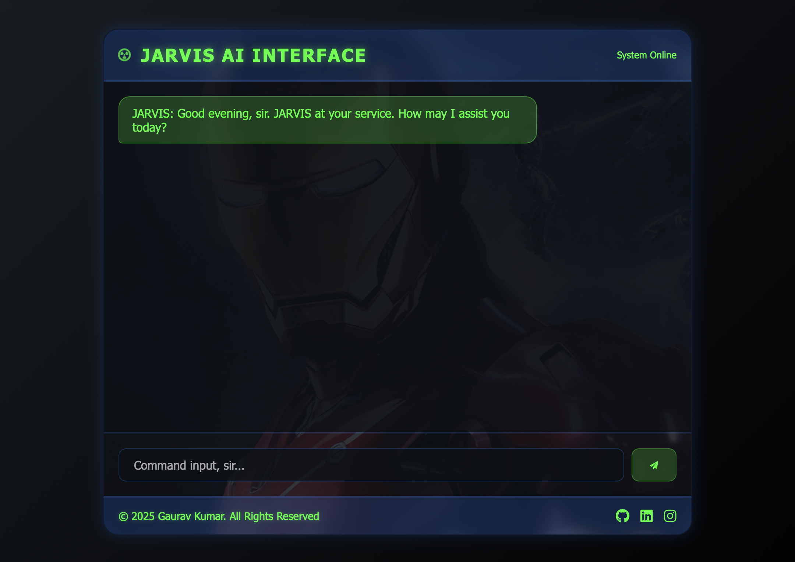

# 🤖 Jarvis AI Chatbot

A web-based AI chatbot inspired by **J.A.R.V.I.S.** from Iron Man, built using **HTML, CSS, JavaScript**, and integrated with **Google's Gemini API** to simulate intelligent and conversational behavior.

## [👀 Live Demo](https://orewagaurav.github.io/Jarvis-AI-Chatbot/)



## 🧠 Features

- 🗨️ Conversational AI experience with JARVIS personality
- 🎯 Uses **Gemini AI API** from Google
- 🧔 Personalized replies addressing the user as "sir" or "Mr. Stark"
- 📜 Scrollable chat history with dynamic updates
- 🔔 Notification sound on response
- 💻 Simple and responsive frontend

## 📁 Project Structure

```plaintext
Jarvis-AI-Chatbot/
├── index.html         # Vite app entry point
├── style.css          # Styling and UI layout
├── src/
│   ├── App.jsx        # React chatbot component
│   └── main.jsx       # React mount point
├── package.json       # Node dependencies and scripts
├── vite.config.js     # Vite configuration
├── .env.example       # Example environment variables
├── .gitignore         # Files ignored by git
└── README.md          # Project documentation
```

---

## ⚙️ Setup Instructions

### 🔐 1. Secure your Gemini API key with `.env`

Create a `.env` file in the project root and add your key:

```env
VITE_GEMINI_API_KEY=your_google_gemini_api_key_here
VITE_GEMINI_API_URL=https://generativelanguage.googleapis.com/v1beta/models/gemini-flash-latest:generateContent
```

> `.env` is excluded from git and should never be committed.

### 📦 2. Install dependencies

```bash
npm install
```

### ▶️ 3. Start the React development server

```bash
npm run dev
```

The app will be available at the local URL shown by Vite.

### ⚠️ Important note

This repository is now a frontend-only React app. Because the Gemini key is used directly in browser JavaScript, the key becomes part of the built frontend bundle.

If you want true secret protection, a backend proxy is still required. This update moves the site to React and `.env` usage, but it does not hide keys from the client-side bundle.

